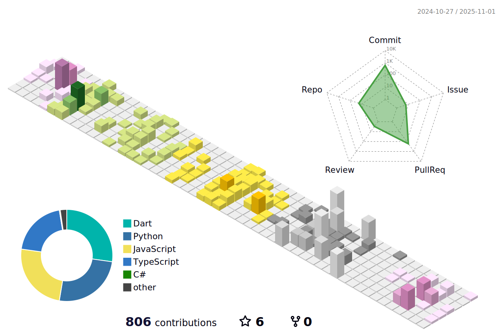

## 👋 Hi, I'm Marco!

🎓 **Management Engineering (B.Sc.)** & **Digital Automation Engineering (M.Sc.)** @UNIMORE 🇮🇹  
🔧 Passionate about **engineering, simulations & software**  
💻 Currently working in **Digital Twin & simulation**

     

## Skills 🥷🏻

### Backend   

  
  
  
  
  

### Frontend  

  <!-- React -->
  
  
  
  
  
  

### Simulators

  <!-- MATLAB -->
  
  
  <!-- Python -->
  
  <!-- AnyLogic -->
  
  <!-- CoppeliaSim -->
  
   <!-- Unreal Engine -->
  

### Databases  

  
  
  
  

### DevOps & Tools  

  
  
  
  

### Contribution  

